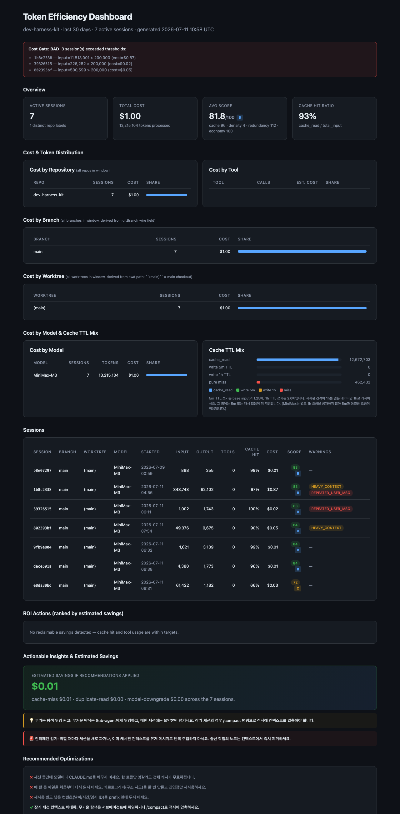

# dev-harness-kit

> AI-네이티브 통합 하네스 플러그인 — 타입이 지정된 서브에이전트 위임,
> Eval-Repair 루프, Human-on-the-Loop 감독과 함께 Plan → Build → Review → Ship을 제공한다.

[](LICENSE)

**언어:** [English](README.md) · 한국어

---

## 빠른 시작

일반적인 배포 루프는 다음과 같다:

```text
install → bootstrap → plan → build → review → ship
```

새 저장소에서는 `/dev-kit:bootstrap-full`로 시작한 다음, 작업이 루프를
진행하는 동안 `/dev-kit:plan`, `/dev-kit:build`, `/dev-kit:review`,
`/dev-kit:ship`을 사용한다. `/dev-kit:skill-usage --top 0`으로 사용 이력이
없는 스킬을 포함한 모든 스킬을 확인할 수 있다.

### 사용 티어

이 티어는 탐색 기본값일 뿐, 하드코딩된 사용량 수치가 아니다. 현재 작업
공간은 `python3 tools/skill_usage.py`로 측정한다 — 리포트의 `turns`와
`invocations`가 실제 사용량의 근거다. 호출된 적 없는 스킬도 찾을 수 있도록
전체 스킬 목록을 여기에 유지한다.

| 티어 | 시작 시점 | 스킬 |
|---|---|---|
| Tier 1 — 배포 루프 | 일반 작업을 시작·구현·리뷰·배포할 때 | `bootstrap`, `bootstrap-full`, `plan`, `build`, `review`, `security`, `babysit-pr`, `ship`, `ci-doctor`, `ci-setup`, `log`, `codex-cache-update`, `skill-usage` |
| Tier 2 — 집중 엔지니어링 | 타깃 진단, 리팩터링, 제거, 설정, 비용 점검이 필요할 때 | `feat-remove`, `inspect`, `audit`, `refactor`, `prune`, `config`, `bump`, `cost-gate`, `status`, `token-analyzer` |
| Tier 3 — 전문/비정기 | 동작을 평가하거나 자산을 복구하거나 리포트를 발행하거나 하네스를 유지보수할 때 | `eval`, `evaluate`, `valuate`, `research`, `interview`, `repair`, `report`, `proposal`, `docs-maintenance`, `llm-refresh`, `prune-propose`, `harness-audit` |

Tier 1이 일반적인 경우를 다루며, Tier 2와 Tier 3은 전문 확장 집합이다.
모델이 호출하는 서브스킬(`build-tdd`, `build-debug`, `build-verify`,
`build-refactor`, `hook-doctor`)은 의도적으로 자동완성에서 숨겨져 한 단계
아래에 있다 — 사용자·모델 구분은
[스킬 대상 구분](#스킬-대상-구분)을 참고한다. 현재 목록과 프런트매터는
다음으로 확인한다:

```bash
find skills -mindepth 2 -maxdepth 2 -name SKILL.md -print | sort
python3 tools/skill_usage.py --days 0 --top 0
```

## 문서

**dev-harness-kit이 처음이라면 여기부터:**

[`docs/home/00-index.ko.md`](docs/home/00-index.ko.md) — 문서화된 진입점
([English](docs/home/00-index.md)). *왜 이 시스템이 존재하는지*, *어떤
가치를 얻는지*, 60초 빠른 시작, 저장소의 모든 문서·ADR·스킬을 분류한 맵을
설명한다.

### 이 플러그인이 무엇인지, 두 문장으로

dev-harness-kit은 모든 저장소에서 Claude Code와 Codex를 위한
`Plan → Build → Review → Ship` 루프를 제공한다. 훅 매트릭스는 모든
Edit/Write/Bash 호출에서 브랜치 위생, 워크트리 격리, 커밋 전 테스트
규율을 직접 강제한다 — 모델은 `git-guard`나 `worktree-guard`를 말로
피해갈 수 없다.

### 사용법 (60초 빠른 시작)

```bash
# 1. 새 저장소 부트스트랩
/dev-kit:bootstrap

# 2. 기능 계획
/dev-kit:plan

# 3. 빌드, 리뷰, 배포 — 각 단계는 스킬 하나가 담당
/dev-kit:build && /dev-kit:review && /dev-kit:ship
```

이것이 전체 루프다. 더 깊은 내용은 문서 인덱스에 있다.

### 문서 맵 (분류별)

대부분의 주제 문서는 `.md`와 `.html` **두 형식 모두** 제공한다 — HTML은
탐색용(고정 상단 내비게이션, 다크/라이트 테마 자동 전환, 코드 블록 복사),
MD는 grep과 GitHub 네이티브 렌더링용이다. 랜딩 페이지와 스킬 인덱스는
Markdown 전용이다. 한국어 버전이 있는 경우 같은 행에 링크되어 있다.

| 주제 | HTML | MD | 한국어 | 얻는 것 |
|---|---|---|---|---|
| 왜 + 가치 + 빠른 시작 | — | [`docs/home/00-index.md`](docs/home/00-index.md) | [`00-index.ko.md`](docs/home/00-index.ko.md) | 입문자 랜딩 — 가장 먼저 읽기 |
| STAGES (각 루프 단계가 소유하는 것) | [`docs/stages/STAGES.html`](docs/stages/STAGES.html) | [`docs/stages/STAGES.md`](docs/stages/STAGES.md) | [`STAGES.ko.md`](docs/stages/STAGES.ko.md) | bootstrap → plan → valuate → build → review → security → ship |
| CI 설치 (다른 곳에서 dev-kit CI 실행) | [`docs/quality/ci-setup.html`](docs/quality/ci-setup.html) | [`docs/quality/ci-setup.md`](docs/quality/ci-setup.md) | [`ci-setup.ko.md`](docs/quality/ci-setup.ko.md) | `branch-policy` + validate + test + auto-fix 워크플로 |
| 유지보수 게이트 (PR 전용 품질) | [`docs/quality/maintenance-gate.html`](docs/quality/maintenance-gate.html) | [`docs/quality/maintenance-gate.md`](docs/quality/maintenance-gate.md) | — | `.github/workflows/maintenance.yml`에서 시행되는 20항목 체크리스트 |
| 런타임 이식성 (Claude Code ↔ Codex) | [`docs/architecture/RUNTIME-PORTABILITY.html`](docs/architecture/RUNTIME-PORTABILITY.html) | [`docs/architecture/RUNTIME-PORTABILITY.md`](docs/architecture/RUNTIME-PORTABILITY.md) | [`RUNTIME-PORTABILITY.ko.md`](docs/architecture/RUNTIME-PORTABILITY.ko.md) | 두 런타임 모두가 지키는 계약, plugin.json이 같은 의미를 갖도록 |
| 네이밍 규칙 (SSOT) | [`docs/naming/NAMING.html`](docs/naming/NAMING.html) | [`docs/naming/NAMING.md`](docs/naming/NAMING.md) · [ADR-0010](docs/adr/ADR-0010-naming-convention.md) | [`NAMING.ko.md`](docs/naming/NAMING.ko.md) | 왜 훅 이름이 `bashHook.sh`가 아니라 `bash-guard.sh`인지 |
| 구현 전 게이트 | [`docs/planning/PRE-IMPL-CHECK.html`](docs/planning/PRE-IMPL-CHECK.html) | [`docs/planning/PRE-IMPL-CHECK.md`](docs/planning/PRE-IMPL-CHECK.md) | — | 코드 작성 전 9가지 질문 |
| 비용과 리스크 | [`docs/quality/COST-ANALYSIS.html`](docs/quality/COST-ANALYSIS.html) | [`docs/quality/COST-ANALYSIS.md`](docs/quality/COST-ANALYSIS.md) | — | 토큰 상한, cost-gate 트레일러 형식 |
| 팀 도입 | [`docs/adoption/team-adoption.html`](docs/adoption/team-adoption.html) | [`docs/adoption/team-adoption.md`](docs/adoption/team-adoption.md) | — | 1인 메인테이너와 20인 팀이 하네스를 다르게 도입하는 이유 |
| 훅 커버리지 갭 (P4 Bucket B 감사) | [`docs/hooks/hook-coverage-gaps.html`](docs/hooks/hook-coverage-gaps.html) | [`docs/hooks/hook-coverage-gaps.md`](docs/hooks/hook-coverage-gaps.md) | — | 어떤 훅 이벤트가 연결됐고 어떤 것이 안 됐는지, 런타임별로 |
| ACP 디스패치 (M-tier 아키텍처) | [`docs/architecture/ACP-DISPATCH.html`](docs/architecture/ACP-DISPATCH.html) | [`docs/architecture/ACP-DISPATCH.md`](docs/architecture/ACP-DISPATCH.md) | [`ACP-DISPATCH.ko.md`](docs/architecture/ACP-DISPATCH.ko.md) | Model-tier 에이전트가 Capability-tier 스킬을 찾고 디스패치하는 방법 |
| ACP (Agent Coordination Protocol) | [`docs/architecture/acp-harness.html`](docs/architecture/acp-harness.html) | [`docs/architecture/acp-harness.md`](docs/architecture/acp-harness.md) | [`acp-harness.ko.md`](docs/architecture/acp-harness.ko.md) | 에이전트 간 통신에 ACP가 쓰는 와이어 포맷 |
| 스킬 레퍼런스 | — | [`docs/skills/README.md`](docs/skills/README.md) | [`README.ko.md`](docs/skills/README.ko.md) | 카테고리 + α 분류가 포함된 전체 스킬 목록 |
| 결정 기록 | — | [`docs/adr/`](docs/adr) | — | 확정된 ADR (역사적 기록, 영어 전용) |
| 저장소 맵 | [`docs/repo/REPOSITORY-MAP.html`](docs/repo/REPOSITORY-MAP.html) | [`docs/repo/REPOSITORY-MAP.md`](docs/repo/REPOSITORY-MAP.md) | — | 트리에서 각 구성 요소가 있는 위치 |

5분밖에 없다면 [`docs/home/00-index.ko.md`](docs/home/00-index.ko.md)
([English](docs/home/00-index.md))를 열어 1–3절(왜, 빠른 시작, 가치)만
읽어도 된다. 나머지는 나중에 읽어도 된다.

## 시행 훅 (변치 않는 해자)

이 플러그인의 핵심 표면은 프롬프트 산문이 아니라 **결정론적 시행**이다.
`CLAUDE.md` Iron Law L7("스킬의 알파는 모델이 스스로 부과할 수 없는
부분에 있다")에 따라, 아래 훅들은 모델의 도구 호출을 직접 가로챈다 —
모델 성능이 좋아진다고 흡수될 수 없는 부분이다.

| 훅 | 하는 일 | 단계 |
|---|---|---|
| `tdd-guard` | 실패하는 테스트 없이 `lib/` 편집을 차단 | Build |
| `bash-guard` | 파괴적인 `git` / `rm` / 셸 이스케이프를 거부 | Build |
| `secret-scan` | 도구 입력에서 자격 증명 패턴을 검열 | 전체 |
| `slop-detector` | 문구 + 구조 뱅크(한/영) 전반의 AI 특유 패턴을 탐지 | Build + Review + Security |
| `worktree-guard` | 메인 체크아웃에서 Edit/Write를 강제 차단; 거부 시 `git worktree list --porcelain`로 현재 워크트리 목록을 출력 | 전체 |
| `git-guard` | 브랜치 전략 시행: main 커밋/푸시, force-push, `gh pr merge`를 차단; 피처 브랜치의 `git push` 시 `plugin.json` 슬롯을 검증 | 전체 |
| `worktree-auto-cut` | 태스크별 워크트리 + 브랜치를 생성 | 전체 |
| `stop-verify` | 세션 종료 전 종료 코드/테스트 수를 인용하도록 요구 | Plan + Design + Build + Review + Security + Ship |
| `review-yml-isolation` | `review.yml` PR을 `review.yml` 단독으로 강제 | 전체 |

스킬(`/dev-kit:*`)은 이 훅들과 상태 머신
(`phases/<name>/index.json` + `STATUS_TRANSITIONS`) 위의 편의 래퍼다.
차세대 모델 테제(issue #295)는 분석 중심 스킬은 흡수된다고 말하지만,
**훅과 상태 머신은 흡수되지 않는다.**

---

## 목차

- [무엇인가](#무엇인가)
- [설치](#설치)
- [플러그인 최신 상태 유지](#플러그인-최신-상태-유지)
- [최초 소비자 설정](#최초-소비자-설정)
- [명령어 레퍼런스](#명령어-레퍼런스)
- [빠른 시작과 사용 티어](#빠른-시작)
- [핵심 개념](#핵심-개념)
  - [워크트리 규칙](#워크트리-규칙)
  - [스킬 대상 구분](#스킬-대상-구분)
- [도구](#도구)
  - [Loghooks](#loghooks-dev-kitlog)
  - [토큰 효율 분석기](#토큰-효율-분석기)
  - [비용 게이트](#비용-게이트)
- [소비자 CI 설치](#소비자-ci-설치)
- [Codex CLI 호환성](#codex-cli-호환성)
- [에이전트 행동 평가](#에이전트-행동-평가)
- [저장소 레이아웃](#저장소-레이아웃)
- [설계 원칙](#설계-원칙)
- [기여하기](#기여하기)

---

## 무엇인가

`dev-harness-kit`은 전체 배포 루프를 커버하는 단일 Claude Code / Codex
플러그인(`dev-kit`)으로 제공된다. 주요 기능:

- **한 명령으로 Plan + Design** — `/dev-kit:plan`은 정량화된 모호성·가치
  점수로 구동되는 5-게이트 루프(`frame → validate → non-goals →
  decompose → emit`)를 통해 고정된 질문지 대신 `PRD.md` +
  `phases/<name>/{index.json, step<N>.md}`를 자동 생성한다.
- **스텝 단위 서브에이전트 Build** — `/dev-kit:build`는 각 스텝을
  TDD + 자동 수정 루프가 통합된 서브에이전트에 위임한다.
- **병렬 Review / Security** — `/dev-kit:review`(정확성 + 보안 +
  아키텍처)와 `/dev-kit:security`(OWASP A01–A10)가 서브에이전트로
  팬아웃하고, 오탐을 걸러내는 검증 패스를 실행한다.
- **에이전트 행동 평가** — `/dev-kit:evaluate`는 기록된 트랜스크립트를
  재생하고 차원별 루브릭과 코드-새니티 체크리스트로 판정한다.
- **Eval-Repair 루프** — 자동 점검 → 전문 수정기 → 최종 사람 검토.
- **Human-on-the-Loop** — 하네스가 자동으로 진행하고, 사람이 마지막에
  승인한다.
- **워크트리 시행** — 훅이 메인 체크아웃 편집을 막고 새 태스크마다
  자신만의 워크트리 + 브랜치를 쓰도록 유도한다.
- **소비자 설치** — `/dev-kit:ci-setup`은 이 저장소 내부와 다운스트림
  소비자 저장소 양쪽에서 동작하는 셀프 어웨어 CI 워크플로 세트를
  제공한다.
- **비용 가시성** — 옵트인 세션 loghook로 채워지는 토큰 효율 대시보드와
  실시간 비용 게이트.
- **세션 모니터** — `python3 tools/session_monitor.py`는 이 저장소의
  워크트리 전반에 걸쳐 모든 Claude Code / Codex 세션을 live / idle /
  stale 상태로 나열한다; 인라인 화살표 키 UI로 하나를 선택하면 `!`로
  실행할 수 있는 정확한 `cd <wt> && claude --resume <sid>` 재개 명령을
  출력한다. `ssh` / 일반 셸에서도 사용 가능한 stdlib 전용 인라인
  선택기도 제공된다.

---

## 설치

Claude Code CLI가 필요하다. `claude plugin …` 명령을 실행하기 전에
[Node 호환성](#node-호환성)을 확인한다.

```bash
# 마켓플레이스 설치 (권장)
claude plugin marketplace add sh-ai-x/dev-harness-kit
claude plugin install dev-kit

# …또는 로컬 체크아웃에서
git clone https://github.com/sh-ai-x/dev-harness-kit
claude plugin marketplace add ./dev-harness-kit
claude plugin install dev-kit

# 매 세션 시작 시
/reload-plugins
```

설치는 `.claude-plugin/plugin.json`의 `version` 필드를 고정하며, 로드된
사본은 버전 이름이 붙은 캐시 디렉터리
(`~/.claude/plugins/cache/dev-kit/dev-kit/<version>/`)에 저장된다.
마켓플레이스 소스는 `main` 브랜치를 추적하므로
(`.claude-plugin/marketplace.json` → `source.ref: main`), 머지될 때마다
새 버전을 사용할 수 있다 — [플러그인 최신 상태 유지](#플러그인-최신-상태-유지)를
참고한다.

### 라이브 소스 개발 (기여자에게 권장)

마켓플레이스 설치는 발행된 버전 하나를 고정한다. 이 저장소를 직접
개발할 때는 재설치 없이 편집 내용이 바로 반영되도록 Claude Code가
로컬 체크아웃을 가리키게 한다:

```bash
claude --plugin-dir /path/to/dev-harness-kit
```

`~/.zshrc`(또는 `~/.bashrc`)에 셸 별칭을 추가하면 타이핑을 줄일 수 있다:

```bash
alias claude-dev='claude --plugin-dir /path/to/dev-harness-kit'

claude-dev   # 프로젝트 디렉터리에서: 재빌드 없이 로컬 편집 내용을 로드
claude       # 마켓플레이스 고정 버전으로 폴백
```

둘 다 사용 가능하면 해당 세션에서는 로컬 `--plugin-dir` 사본이 우선한다.

> **`~/.claude/skills/dev-kit`을 이 저장소로 심볼릭 링크하지 말 것.**
> 마켓플레이스 설치와 skills-dir 플러그인이 같은 `name`을 공유하면
> 충돌하고, 로더가 두 번째 사본을 거부한다. 플래그 없는 라이브 소스
> 설치에는 위의 별칭을 사용한다.

### Node 호환성

번들된 Claude Code CLI는 **Node ≥ 25**에서 크래시한다
(`cli.js:384`의 `TypeError: Cannot read properties of undefined
(reading 'prototype')`). 모든 `claude plugin …` 명령은 **Node 22**에서
실행한다:

```bash
nvm install 22 && nvm use 22
```

`--plugin-dir` 플래그는 영향받지 않는다 — 실패하는 CLI 경로를 완전히
우회한다.

---

## 플러그인 최신 상태 유지

마켓플레이스 설치는
`~/.claude/plugins/cache/dev-kit/dev-kit/<version>/`에 캐시된 사본을
로드한다. PR이 `main`에 머지된 후에는 새로 고치기 전까지 이 캐시가
오래된 상태로 남는다.

**새로 고쳐야 할 때:**

- `main`에 PR이 머지되었고 현재 세션에서 새 동작을 쓰고 싶을 때.
- `/dev-kit:*` 출력이 더 이상 최신 소스와 일치하지 않을 때.
- 소비자 저장소의 `/dev-kit:ci-setup`이 누락된 파일을 보고할 때(예:
  `scripts/branch-policy.sh: No such file or directory`) — 캐시가
  오래된 상태다.

### Claude Code

`dev-kit` 마켓플레이스 항목은 `main`을 가리키므로, 머지될 때마다
마켓플레이스 카탈로그가 고정 버전을 자동으로 올린다. 가장 깔끔한
방법은:

```bash
# 권장: 마켓플레이스에서 최신 고정 버전을 가져온다.
# 어떤 셸에서도 동작하며, Claude Code 세션 내부에서도 업데이터 경로가
# CLI 버그를 우회한다 (위 "Node 호환성" 참고).
claude plugin update dev-kit
```

이것이 실패하면(가장 흔한 원인은 Claude Code 세션 내부에서 번들된
CLI가 Node `TypeError`를 던지는 경우), 유지보수 스크립트가 원시
`git pull` + `rsync`로 같은 작업을 수행한다:

```bash
# 탈출구: 마켓플레이스 클론을 pull하고 버전 캐시로 rsync한다.
bin/devkit-refresh.sh
bin/devkit-refresh.sh --dry-run    # 먼저 변경 내용을 확인
```

> **`devkit-refresh.sh`가 존재하는 이유:** `claude plugin install
> --force`와 `claude plugin update` 모두 Claude Code 세션 *내부에서*
> 호출되면 위와 같은 Node `TypeError`를 던지는 동일한 CLI 경로를
> 탄다. 이 스크립트는 어디서나 동작하는 일반 `git pull` + `rsync`로
> 같은 작업을 한다. `plugin.json`에서 캐시 버전을 읽으며(필드가 없으면
> 마켓플레이스 클론의 짧은 SHA로 폴백), 배포된 훅/템플릿 스크립트의
> 실행 권한 비트를 보존한다.

그마저 사용할 수 없다면 캐시를 수동으로 새로 고칠 수 있다:

```bash
cd ~/.claude/plugins/marketplaces/dev-kit && git pull origin main --ff-only
rsync -a --delete --exclude=.git \
  ~/.claude/plugins/marketplaces/dev-kit/ \
  ~/.claude/plugins/cache/dev-kit/dev-kit/<version>/
```

### Codex

```bash
bash skills/codex-cache-update/scripts/update.sh
bash skills/codex-cache-update/scripts/update.sh --dry-run   # 확인만
```

Codex 마켓플레이스 체크아웃을 업그레이드하고 일치하는 버전 캐시를
동기화한다 — 마켓플레이스 명령이 이미 최신이라고 보고하는 경우에도
동작하며, 마켓플레이스 경로·매니페스트 버전·캐시 경로와 마지막
`cache synchronized` 줄을 출력한다. 기본 설치가 아닌 경우 경로를
재정의한다:

```bash
CODEX_MARKETPLACE_DIR="$HOME/.codex/.tmp/marketplaces/dev-kit" \
CODEX_CACHE_ROOT="$HOME/.codex/plugins/cache/dev-kit/dev-kit" \
bash skills/codex-cache-update/scripts/update.sh
```

새로 고친 후에는 클라이언트를 재시작하거나, 지원되는 경우
`/reload-plugins`를 실행한다.

---

## 최초 소비자 설정

대부분의 사용자는 소비자다. "새 저장소가 있다"의 엔드투엔드 흐름:

```bash
# 1. 생성 + 클론
gh repo create myorg/myrepo --private --clone && cd myrepo

# 2. 플러그인 설치
claude plugin marketplace add sh-ai-x/dev-harness-kit
claude plugin install dev-kit
# (라이브 소스: claude --plugin-dir /path/to/dev-harness-kit)

# 3. 원샷 설정: CLAUDE.md + AGENTS.md + active-hooks.json + CI 템플릿
/dev-kit:bootstrap-full
#    = /dev-kit:bootstrap 다음 /dev-kit:ci-setup --force.
#    절반만 원하면 각각 따로 실행한다.

# 4. 첫 커밋 + 푸시
git add -A && git commit -m "chore: bootstrap dev-kit"
git push -u origin main
```

**최초 설치에는 `--force`를 사용한다.** 새 저장소에서는 결과가 기본
설치와 동일하지만(어느 쪽이든 모든 파일이 복사된다), `--force`는 이전
시도의 부분 실패와 오래된 플러그인 캐시에도 견고하다. 업스트림 템플릿
변경을 받으려면 나중에 다시 `--force`로 실행한다 — 새로 고침과 최초
설치의 차이는 [소비자 CI 설치](#소비자-ci-설치)를 참고한다.

일반적인 다음 단계: `/dev-kit:plan`으로 PRD와 phases를 생성한다.

---

## 명령어 레퍼런스

`/dev-kit:<skill>`로 호출한다. 이 목록은 사용자용 진입점을 워크플로
단계별로 묶은 것이며, `SKILL.md`에 `user-invocable: true`가 있는
스킬만 슬래시 자동완성에 나타난다. 현재 확정된 목록은 해당
프런트매터(또는 자동완성)로 확인한다 — [스킬 대상 구분](#스킬-대상-구분)을
참고한다.

**설정**

| 명령 | 목적 |
|---|---|
| `/dev-kit:bootstrap` | 최초 진입 — `CLAUDE.md` 생성 |
| `/dev-kit:bootstrap-full` | bootstrap + ci-setup 원샷 (신규 프로젝트 기본값) |
| `/dev-kit:ci-setup` | CI 템플릿 설치 (워크플로 + 훅 + 스크립트 + 워크트리 파일) |
| `/dev-kit:ci-doctor` | CI 준비 상태에 대한 읽기 전용 PASS/FAIL 감사 |
| `/dev-kit:log setup\|on\|off\|status` | 프로젝트별 세션 loghook 토글 |
| `/dev-kit:config` | 스킬 / MCP / 훅 / 방법론 선택기 |

**Plan → Build**

| 명령 | 목적 |
|---|---|
| `/dev-kit:plan` | PRD + phases (Plan + Design 통합) |
| `/dev-kit:build` | 스텝별 서브에이전트 실행 |
| `/dev-kit:adapt` | 빌드 중 plan/spec 수정 |
| `/dev-kit:feat-remove` | 기능 제거 (콜그래프 스윕 + 삭제 리포트) |

**Review → Ship**

| 명령 | 목적 |
|---|---|
| `/dev-kit:review` | 3차원 리뷰 (정확성 + 보안 + 아키텍처) |
| `/dev-kit:security` | OWASP A01–A10 감사 |
| `/dev-kit:audit` | 일괄 슬롭 + 시크릿 감사 |
| `/dev-kit:inspect` | 8차원 코드 건강 감사 (읽기 전용) |
| `/dev-kit:refactor` | 3단계 리팩터링: inspect → cleanup → review |
| `/dev-kit:prune` | 4단계 삭제 스윕: sweep → dependents → report → verify (`--target <feat>`로 특정 기능 지정) |
| `/dev-kit:babysit-pr` | PR 베이비시터 루프 (CI 폴링, 수정, 반복) |
| `/dev-kit:ship` | 릴리스 태그 |
| `/dev-kit:bump [major\|minor\|patch]` | 명시적 버전 범프 + 푸시 |

**평가 / 비용 / 리포팅**

| 명령 | 목적 |
|---|---|
| `/dev-kit:evaluate` | 에이전트 행동 평가 (review/security/plan + code-sanity, harness/os-quality 포함) |
| `/dev-kit:repair approve\|reject\|defer <asset>` | Eval-Repair 사람 검토 |
| `/dev-kit:report` | eval + inspect 리포트용 HTML 뷰어 |
| `/dev-kit:token-analyzer` | 세션 로그 기반 토큰 효율 대시보드 |
| `/dev-kit:cost-gate` | 실시간 비용 게이트 (지출 + 임계값 + 커밋 푸터) |
| `/dev-kit:status` | HOTL 시각화: 루프 진행 + 사이클 + 핸드오프 체인 |
| `/dev-kit:llm-refresh` | 각 벤더 가격 페이지에서 `docs/llm-info/<provider>.json` 새로고침 |
| `/dev-kit:codex-cache-update` | Codex 마켓플레이스 + 버전 캐시 동기화 (CLI 탈출구) |
| `/dev-kit:skill-usage [옵션]` | `tools/skill_usage.py` 실행, turns/invocations 표시 |

**문서 / 단축 명령**

| 명령 | 목적 |
|---|---|
| `/dev-kit:proposal` | `docs/proposals/<name>.yaml` → 자체 완결 HTML 렌더 |
| `/dev-kit:docs-maintenance` | 오래된 문서 감사, README 새로고침, 변동성 있는 사실 제거 |

---

## 핵심 개념

### 워크트리 규칙

정식 규칙은 `rules/git-workflow.md`다. Claude Code는 `.claude/rules`
호환 심볼릭 링크를 통해 이를 찾고, Codex는 `AGENTS.md`를 통해 같은
파일을 읽는다. 이 요구사항은 강제적이다:

> **모든 태스크 = 새 워크트리 + 클라이언트 핸드오프 + 새 브랜치.**
> Claude Code는 워크트리에서 새 세션을 열고, Codex는 그곳에서
> 서브에이전트를 스폰한다. 이전 태스크의 브랜치나 메인 체크아웃에서는
> 편집하지 않는다.

네 개의 훅으로 시행된다:

- `worktree-guard.sh` — 메인 체크아웃의 모든 Edit/Write를 강제 차단.
- `worktree-auto-cut.sh` — 메인 체크아웃에서 새 태스크 프롬프트가
  오면 슬러그를 도출해 워크트리를 만들고 태스크를 넘긴다; 실패하면
  수동 생성 안내로 폴백.
- `session-start-check.sh` — 세션 시작 시 부드러운 리마인더.

정식 워크트리 경로는 저장소 루트의 클라이언트 중립적
`.worktrees/<slug>/`이므로, Claude Code와 Codex가 한 브랜치에 대해
같은 체크아웃을 연다. 레거시 `.claude/worktrees/`와
`.codex/worktrees/` 체크아웃은 로그 분석을 위해 계속 찾을 수 있지만,
새 자동 생성은 `.worktrees/`를 사용한다. 이 워크트리 규칙 파일들은
`templates/ci/`를 통해 소비자 저장소에도 배포된다.

### 스킬 대상 구분

모든 `SKILL.md`는 `user-invocable` 프런트매터 플래그를 갖는다:

- **`user-invocable: true`** (또는 미설정) — `/dev-kit:` 자동완성에
  나타난다. *사용자*가 직접 입력한다.
- **`user-invocable: false`** — 숨겨진다. 부모 스킬이 실행될 때
  *Claude*가 서브스텝으로 자동 호출한다.

이것이 두 스킬 대상 사이의 경계다:

- **사용자 호출 스킬** (`user-invocable: true`) — 사용자가
  `/dev-kit:` 자동완성에서 선택하는 명시적 워크플로/유틸리티.
- **모델 전용 스킬** (`user-invocable: false`) — 이벤트나 부모
  워크플로가 필요로 할 때 모델이 선택하는 내부 전문가. `hook-doctor`가
  모델 전용의 예다: 훅 실패 텍스트가 보이면 사용자가 두 번째 슬래시
  명령을 알 필요 없이 진단이 트리거되어야 한다.

스킬 이름이 자동완성되지 않는다면 내부 서브스킬이다 — 그 대신
사용자용 부모 스킬을 입력한다(예: `/dev-kit:build-refactor`가 아니라
`/dev-kit:refactor`). 멘탈 모델: 사용자용 스킬은 동사(*무엇을*)이고,
내부 스킬은 그 기계 장치(*어떻게*)다.

[`skills/README.md`](skills/README.md)는 플러그인이 배포하는 모든
스킬의 정식 사람이 읽기 쉬운 인덱스이며, `category:` 프런트매터
필드로 그룹화되고 알파벳순 폴백 목록이 딸려 있다. 모든 `SKILL.md`는
본문 맨 위에 `> [← Skills index](../../README.md)` 백링크를 가지므로
어떤 스킬에서든 인덱스로 돌아올 수 있다. 탐색에는 `skills/README.md`를,
호출에는 슬래시 자동완성을 사용한다. 이 README는 실시간 스킬 목록을
중복하지 않는다 — 목록이 너무 자주 바뀌어 손으로 유지하는 개수는
정확성을 유지할 수 없다. 현재 개수는 다음으로 확인한다:

```bash
find skills -mindepth 2 -maxdepth 2 -name SKILL.md | wc -l
```

훅이 `failed`나 `exited with code`를 보고하면 숨겨진 `hook-doctor`
스킬이 자동으로 호출된다. 프로바이더별 매니페스트, 런타임 의존성,
플러그인 루트, 플러그인 버전을 확인한 다음 복구가 가능할 때만 안전한
프로바이더 캐시 업데이터를 실행한다. 훅은 세션 시작 시 로드되므로
캐시 복구 후에도 클라이언트 재시작이 필요하다.

각 스킬에 대한 더 긴, 사람 대상 설명(개요, 사용 시점, 동작 방식,
플래그, 출력)은 [`docs/skills/README.md`](docs/skills/README.md)를
참고한다. 사용자 호출 스킬과 모델 호출 서브스킬도 구분하며,
`/dev-kit:token-analyzer`를 비롯한 모든 스킬의 상세 내용은 이 README가
아니라 그곳에 있다.

### 스킬 구성

각 단계별 스킬은 자체 사전 점검, AC, 핸드오프를 소유한다:

| 스킬 | 단계 | 읽는 것 | 쓰는 것 |
|---|---|---|---|
| `/dev-kit:plan` | Plan | 운영자 프롬프트 | `PRD.md`, `phases/<name>/step<N>.md`, `phases/<name>/index.json` |
| `/dev-kit:valuate` | Valuate | `.dev-kit/hand-off/plan*.md` | `.dev-kit/valuations/<plan-id>.json` |
| `/dev-kit:build` | Build | `phases/<name>/index.json` + 스텝별 파일 | 스텝별 `output.json` |
| `/dev-kit:review` | Review | PR diff | 판정 (Approve / Changes Requested / Blocked) |
| `/dev-kit:security` | Security | PR diff | OWASP별 판정 |
| `/dev-kit:ship` | Ship | Review 판정 + AC 출력 | `git tag` + CHANGELOG 항목 |

판정 봉투 계약은 `lib/valuation_engine.py:decision_is_canonical_envelope`
(`decision` / `rationale` / `blocking_findings` 3개 키)에 고정되어 있다.
비-PROCEED 판정에서 `build`를 강제 차단하던 Phase 4 자동 게이트는
그것을 뒷받침하던 LCS 서브스트레이트와 함께 #463에서 제거되었다;
운영자는 이제 `/dev-kit:valuate`를 명시적으로 실행하며, 비-PROCEED
판정을 플래그하지 않는 한 build는 계속 진행된다.

---

## 도구

### Loghooks (`/dev-kit:log`)

독립 실행형 [`loghooks`](https://github.com/sh-ai-x/loghooks)
저장소(Claude Code `Stop` + `SessionEnd`, Codex 대응 훅 포함)를
프로젝트별 원-커맨드 on/off 토글로 감싼다.

```bash
/dev-kit:log setup   # tools/save_log.py 복사 + logs/{claude-code,codex}/ 스캐폴드
/dev-kit:log on      # .claude/settings.json + .codex/hooks.json에 훅 병합
/dev-kit:log status  # managed=N captured=N
/dev-kit:log off     # 센티널 태그가 붙은 항목만 제거; 스캐폴드는 유지
```

설치된 모든 항목은 `_loghooks_managed=true`를 가지며, `off`는 그
항목만 제거하므로 기존 사용자 훅은 살아남는다. 캡처된 트랜스크립트는
`logs/<tool>/<branch>/<sid>.jsonl`(`gitBranch`별로 그룹화)에 저장되고
gitignore된다. [`logs/README.md`](logs/README.md)와
`skills/log/SKILL.md`를 참고한다.

### 토큰 효율 분석기

stdlib 전용 Python CLI(`tools/token_efficiency_analyzer.py`)는
loghook이 캡처한 `logs/{claude-code,codex}/**/*.jsonl` 트랜스크립트를
의존성·JavaScript·네트워크 없이 자체 완결 HTML 대시보드 하나로
변환한다. 사용자용 진입점은 `/dev-kit:token-analyzer` 스킬이며, CLI도
CI 용도로 직접 호출할 수 있다:

```bash
python3 tools/token_efficiency_analyzer.py --repo "my-project" --days 30
open token-dashboard-my-project-30d.html
```

전체 상세(플래그, 4차원 점수 루브릭, 6가지 경고 트리거, 모델별 가격
표)는 [`docs/skills/token-analyzer.md`](docs/skills/token-analyzer.md)에
있다.

### 미리보기



*위 스크린샷은 `tools/render_dashboard.py`(Playwright + Chrome,
1440 × 2x)로 최신 대시보드 HTML에서 재생성된다.
`tools/token_efficiency_analyzer.py`가 바뀌면 새로 고친다.*

### 비용 게이트

사후 토큰 대시보드와는 구분되는 **읽기 전용** 비용 레이어다:
cost-gate는 요청 시 현재 원장을 출력하고 PR 집계기가 필요로 하는
트레일러 블록을 내보내는 반면, 분석기는 과거 세션을 재생한다.
**게이트는 관찰만 하며 도구 호출을 차단하지 않는다.** 전체 상세(경고/플래그
임계값 표, 오버라이드 환경 변수, 커밋 트레일러 형식)는
[`docs/skills/cost-gate.md`](docs/skills/cost-gate.md)에 있다.

### 세션 모니터 (`tools/session_monitor.py`)

CLI 형태는 일반 셸에서 노출되는 것과 같은 데이터 레이어다: `ssh` 위,
CI 안, 간단한 `Terminal.app` 창, 또는 키 하나로 특정 워크트리의
대화로 돌아가고 싶은 어디서든 사용한다.

```bash
# 인라인 대화형 선택기 (실제 TTY 필요 — 화살표 키 + Enter)
python3 tools/session_monitor.py

# 일반 목록 (TTY 없이도 동작; 어떤 하네스에서도 안전)
python3 tools/session_monitor.py --list --days 30

# 스크립팅/비-Claude-Code 호출자를 위한 기계 판독 JSON
python3 tools/session_monitor.py --json --days 30 | jq '.total_sessions, .live_sessions'

# 첫 세션의 재개 argv 합성을 디버그
python3 tools/session_monitor.py --print-resume-command
# -> cd /Users/sanghee/dev/dev-harness-kit && claude --resume <sid>

# rc 파일에 `session-monitor` 셸 별칭 설치 (멱등)
python3 tools/session_monitor.py --cli-setup
# -> 그다음: source ~/.zshrc   (이제 어떤 cwd에서든 `session-monitor` 사용 가능)
```

`--list` 출력과 대화형 선택기 모두 세션을 워크트리별로 그룹화하고
각 그룹 헤더 아래 `STATUS SRC ID MODEL BRANCH AGE` 열 라벨 줄을
출력하므로, `branch`가 자체 라벨이 붙은 열로 읽힌다.

대화형 선택기는 `termios` + ANSI 이스케이프 위에 직접 구축되어
있다(stdlib 전용, `curses` 없음, 서드파티 의존성 없음). `Enter`를
누르면 원래 `termios` 모드를 복원하고, 세션의 워크트리로 `cd`한 다음
`claude --resume <sid>`(Claude Code) 또는 `codex resume <sid>`(Codex)를
`exec`한다 — `exec`가 Python 프로세스를 대체하므로 사용자는 재개된
세션에 바로 들어간다. 워크트리가 사라졌거나 머지되었다면 선택기는
메인 체크아웃으로 폴백하고 경고를 출력한다.

각 세션의 `branch`는 워크트리의 현재
`git rev-parse --abbrev-ref HEAD`로 덮어써지므로, 선택기는 로그 저장
시점에 캡처된 브랜치가 아니라 워크트리가 *실제로* 있는 브랜치를
보여준다. 오래된 워크트리(머지됨/사라짐)와 detached-HEAD 워크트리는
로그에 캡처된 브랜치를 폴백으로 유지한다.

**공통 플래그**

| 플래그 | 기본값 | 목적 |
|---|---|---|
| `--days N` | `30` | 조회 기간; 이보다 오래된 세션은 제외 |
| `--repo <name>` | (없음) | 저장소 basename에 대한 부분 문자열 필터 |
| `--logs-dir <path>` | `<main-repo>/logs` | `claude-code/`와 `codex/` 하위 디렉터리의 루트 |
| `--list` | off | 일반 stdout 목록 (어떤 하네스에서든 미리보기 가능) |
| `--json` | off | 스크립트/스킬 소비자를 위한 기계 판독 출력 |
| `--print-resume-command` | off | 첫 세션의 cwd + argv를 출력하고 종료 |
| `--cli-setup` | off | `~/.zshrc`/`~/.bashrc`에 `session-monitor` 별칭 설치(멱등); 종료 |
| `--dry-run` | off | `--cli-setup`과 함께, 쓰지 않고 별칭 블록만 출력 |

**상태 의미**

| 기호 | 상태 | 의미 |
|:---:|---|---|
| `●` | `live` | 실행 중인 `claude`/`codex` 프로세스가 해당 세션의 워크트리에 cwd로 있거나, 마지막 턴이 180초 이내 |
| `○` | `idle` | 캡처되었고 `--days` 범위 안이지만 최근에 활동이 없음 |
| `⌀` | `stale` | 워크트리가 `main`에 머지되었거나 사라짐; 재개는 메인 체크아웃으로 폴백 |

**왜 스킬과 도구를 둘 다 두는가:** 스킬은 하네스가 필요하고
(`AskUserQuestion`을 렌더링하려면), CLI는 TTY가 필요하다(선택기를
렌더링하려면). 둘은 `discover → aggregate → group → enrich → render`라는
하나의 데이터 레이어를 공유하며, 스킬의 `--json` 모드는 말 그대로 CLI의
JSON 출력을 모델에 그대로 파이프한 것이다. 어느 쪽에도 LLM이 루프
안에 있지 않다 — 둘 다 `/dev-kit:log` 트랜스크립트의 순수 소비자다.

### 스킬 사용량 (`tools/skill_usage.py`)

같은 `/dev-kit:log` 트랜스크립트에 대한 스킬별 원격 측정: 두 개의
서로 다른 신호 — `attributionSkill` 턴 수(스킬이 한 작업의 깊이/양)와
명시적 `Skill` 도구 사용 블록(사람이 직접 호출한 횟수) — 를
집계한다. 턴은 많은데 호출은 적으면 베이비시터 루프로 읽히고, 둘 다
낮으면 정리 대상이며, 턴과 호출이 둘 다 높으면 헤비 유저다. 작업
공간 귀속은 `cwd`별로 캡처되므로 타깃 프로젝트 사용량을 자체 개발
사용량과 분리할 수 있다.

```bash
# 상위 스킬 (기본 30일 창) - markdown 표를 stdout으로
python3 tools/skill_usage.py

# 설치된 명령 래퍼로 같은 리포트
/dev-kit:skill-usage

# 한 워크스페이스로 좁히고, 창을 새로 설정
python3 tools/skill_usage.py --cwd /path/to/project --days 7

# 기계 판독, 예: plan이나 eval 스크립트로 파이프
python3 tools/skill_usage.py --json | jq '.[0:5]'

# 한 워크트리의 세션 목록으로 범위를 좁힌 같은 데이터
python3 tools/session_monitor.py --skill-usage --skill-days 30
```

stdlib 전용; `--days 0`은 시간 창을 비활성화; `--cwd <prefix>`는 한
작업 공간으로 필터링한다. `tools/session_monitor.py`의
`--skill-usage` / `--skill-days` 플래그는 같은 집계기를 재사용해
워크트리별 세션 목록 옆에 스킬별 합계를 출력한다.

선택한 창에서 활동이 전혀 없는 스킬까지 포함하려면 `--top 0`을
사용한다. 이 행들은 전체 목록을 확인하거나 전문 스킬에 더 나은 문서나
정리 리뷰가 필요한지 판단하는 데 유용하다; 캡처된 사용량이 0이라고
해서 그 스킬이 쓸모없다는 증거로 여기지 않는다.

---

## 소비자 CI 설치

`/dev-kit:ci-setup`이 *다른* 저장소에서 dev-kit이 동작하게 만드는
장치다. 다음을 복사한다:

- GitHub Actions 워크플로 (ci, auto-fix-pr, review)
- 스크립트 (validate, test, branch-policy, ci-local)
- pre-push 훅
- 워크트리 규칙 파일 (hooks, lib, rule, tests)

배포되는 `review.yml`은 **셀프 어웨어**다: 체크아웃이 dev-kit
플러그인 자체(자체 설치)인지 일반 소비자 저장소(공개 소스에서
클론)인지 감지하므로, 워크플로 파일 하나로 두 상황 모두에서 동작한다.

**CI 리뷰 프로바이더 전환:** 프로바이더 선택은 환경 변수 기반이다 —
커밋된 기본값이 없으므로, 같은 저장소를 서로 다른 운영자가 서로 다른
프로바이더로 충돌 없이 사용할 수 있다.

- **로컬** (GitHub Actions 밖에서 `/dev-kit:review`를 실행할 때):
  `.env:CI_REVIEW_PROVIDER`에 설정한다. `bin/set-provider.sh
  <provider>`로 관리한다 — 키를 upsert하고, diff를 출력하고, 일치하는
  GitHub 저장소 변수 + 시크릿을 설정하라고 알려준다. `.env`는
  gitignore되므로 사용자별로 다르다.
- **CI** (`.github/workflows/review.yml`): GitHub 저장소 변수
  `vars.CI_REVIEW_PROVIDER`에서 읽으며, `workflow_dispatch`의
  `review_provider` 입력이 실행별 오버라이드가 된다.
  `gh variable set CI_REVIEW_PROVIDER --body
  <minimax|anthropic|deepseek>`로 설정한다. 둘 다 설정되지 않으면
  워크플로는 해결 힌트와 함께 크게 실패한다.

각 프로바이더는 일치하는 저장소 시크릿(`MINIMAX_API_KEY`,
`ANTHROPIC_API_KEY`, `DEEPSEEK_API_KEY`)도 `gh secret set`으로 필요로
한다. `.github/workflows/review.yml` 자체를 편집하는 PR은
`claude-code-action`의 변조 방지 가드에 의해 스킵된다 — 예상된
동작이며, PR이 머지되면 해결된다.

### `--force`: 언제 쓰고 언제 쓰지 않는가

`ci-setup`은 **기본적으로 멱등**하다 — 마커
`.dev-kit/ci-config.json`이 설치 시각 + 콘텐츠 해시를 기록하므로,
일치하는 재실행은 아무 일도 하지 않는다. `--force`는 무조건 예상
파일을 덮어쓴다.

**`--force`를 쓸 때**: 최초 설치, 새로 추가되거나 고쳐진 템플릿을
받을 때, 또는 설치가 오래됐거나 부분적이라고 의심될 때(마커는
있는데 파일이 없거나 어긋남). **`--force`를 피할 때**: 업스트림
변경이 없는 깨끗한 재실행, 또는 설치된 파일을 직접 편집한 경우
(로컬 커스터마이징을 덮어쓴다 — 먼저 diff를 확인한다).

```bash
bin/devkit-refresh.sh                         # 1. 캐시를 최신 템플릿으로 새로고침
cd /path/to/consumer-repo
/dev-kit:ci-setup --force                      # 2. 설치
git diff .github/ scripts/ .githooks/ hooks/ .claude/ tests/   # 3. diff 검토
/dev-kit:ci-doctor                             # 4. 준비 상태 확인 (PASS까지 반복)
git add -A && git commit -m "chore(ci): refresh dev-kit templates"   # 5. 커밋
```

---

## Codex CLI 호환성

Codex CLI의 플러그인 포맷([openai/plugins](https://github.com/openai/plugins))은
스킬 디렉터리를 가리키는 `"skills"` 필드와 번들된
`.codex-plugin/hooks/hooks.json`을 가리키는 `"hooks"` 필드를 가진
`.codex-plugin/plugin.json` 매니페스트다. 그 번들 사본은 정식
`hooks/hooks.json`을 미러링하며(Codex는 플러그인 훅 파일이 플러그인
루트 안에 있어야 한다), 회귀 테스트가 두 이벤트 목록을 동기화된
상태로 유지한다. Codex 명령은 `${PLUGIN_ROOT}`를 쓰고, Claude Code는
`${CLAUDE_PLUGIN_ROOT}`를 쓰며 `hooks/hooks.json`을 직접 계속
로드한다.

플러그인을 활성화한 후에는 Codex에서 `/hooks`로 훅을 검토하고
신뢰한다 — 새로 생기거나 바뀐 미관리 훅은 신뢰되기 전까지 건너뛴다.
로컬 상태 확인:

```bash
python3 bin/dev-kit-hooks-status.py          # 사람이 읽기 쉬운 형태
python3 bin/dev-kit-hooks-status.py --json    # 기계 판독 형태
```

이 리포트는 Claude Code 등록, Codex 등록 + 신뢰, `.dev-kit/.active-hooks.json`
매트릭스, Git의 별도 pre-commit/pre-push 훅을 구분한다. pre-commit
게이트는 호스트에 설치된 Ruff로 스테이징된 Python 파일을 검사하며
자동 수정하지 않는다; pre-push는 브랜치와 버전 정책을 지킨다. Ruff를
설치한 후 두 훅을 모두 활성화한다:

```bash
brew install ruff                              # macOS
apt install ruff                               # Debian/Ubuntu
git config core.hooksPath .githooks
```

### 훅 목록

| 훅 | 이벤트 | 목적 | 모드 |
|---|---|---|---|
| `tdd-guard.sh` | PreToolUse (Write\|Edit\|MultiEdit) | TDD 테스트 우선 시행 | advisory / `--strict` |
| `bash-guard.sh` | PreToolUse (Bash) | 파괴적 명령 차단 | advisory / `--strict` |
| `git-guard.sh` | PreToolUse (Bash) | 브랜치 전략 시행 | hard-block |
| `worktree-guard.sh` | PreToolUse (Write\|Edit\|MultiEdit) | 메인 체크아웃 편집 차단 | hard-block |
| `review-yml-isolation.sh` | PreToolUse (Bash) | `review.yml` 변경을 자체 커밋/PR로 강제 | hard-block |
| `worktree-auto-cut.sh` | UserPromptSubmit | 메인에서 새 태스크 프롬프트에 대해 워크트리 자동 생성 | advisory (fails open) |
| `session-start-check.sh` | SessionStart | 워크트리 규칙 리마인드 | advisory |
| `log-on-session-start.sh` | SessionStart | 매 세션마다 loghook 자동 설치 (멱등) | advisory |
| `provider-divergence-check.sh` | SessionStart | `.env:CI_REVIEW_PROVIDER`가 목록 밖이거나 어긋나거나 없을 때 알림 | advisory |
| `secret-scan.sh` | PostToolUse (Write\|Edit) | 편집에서 자격 증명 탐지 | hard-block |
| `slop-detector.sh` | PostToolUse (Write\|Edit) | AI 슬롭 차단 (문구 + 구조 + 점수, 한/영) | advisory (선택적 strict) |
| `worktree-log-auto-install.sh` | PostToolUse (Bash) | 새로 추가된 워크트리에 loghook 설치 | advisory |
| `acp-tier-assert.sh` | PreToolUse (`*`) | 첫 도구 호출에서 ACP 에이전트 tier-assertion 줄 시행 (M/T/L) | hard-block |
| `stop-verify.sh` | Stop | 세션 종료 시 회귀 테스트 실행 | hard-block |

---

## 에이전트 행동 평가

`/dev-kit:evaluate`는 dev-kit 스킬을 실행할 때 **에이전트가 올바른
입력에 올바른 출력을 내는지**를 측정한다. 단위는 *케이스 픽스처 + 기록된
트랜스크립트 → 차원별 루브릭 판정*이다. v1은 재생 전용이다: 기록된
트랜스크립트가 없는 케이스는 `SKIPPED`(회귀가 아니라 설정 공백)다.

**세 가지 핵심 평가 차원** (각 축 0–10):

| 차원 | 축 | 측정하는 것 |
|---|---|---|
| `review` | 판정 일관성 · 심각도 보정 · 정밀도 · 재현율 · code-sanity | 리뷰 판정 + 발견사항 품질 |
| `security` | OWASP 분류 · 심각도 정확도 · 정밀도 | A01–A10 매핑 + 오탐률 |
| `plan` | 스펙 명확성 · 스텝 원자성 · AC 실행 가능성 · 의존성 순서 | 원자적이고, 실행 가능하고, 빌드 가능한 계획 |

`/dev-kit:evaluate`(플래그 없이)가 이 세 가지를 커버한다. **`--harness-quality`**
또는 **`--os-quality`**를 추가하면 같은 하부 러너의 `--dim` 플래그로
해당 횡단 루브릭(env/시크릿/CI 비용 점검)을 등록한다 —
[`docs/skills/evaluate.md`](docs/skills/evaluate.md)와
`eval/rubrics/` 레지스트리를 참고한다.

케이스별 축 평균 → 판정: **OK** ≥ 8.0 · **DRIFT_WARNING** 5.0–7.9 ·
**ROT** < 5.0 · **SKIPPED** (트랜스크립트 없음). `review` 차원은
`ADR-0022`에 고정된 20항목 code-sanity 루브릭(clean-code + 과설계 +
가치/의미)을 내장한다.

```bash
# 전체 평가 → .dev-kit/eval-report.md
python lib/eval_runner.py --project-root . [--dry-run]
python lib/eval_runner.py --project-root . --dim plan
python lib/eval_runner.py --project-root . --case review-04-factory-one-impl
```

`--dry-run`은 LLM 호출을 건너뛴다(각 케이스를 7.0/DRIFT_WARNING으로
모킹) — API 키 없는 CI에서 유용하다. 케이스 추가는 코드 변경이 필요
없다: `eval/cases/<dim>/`에 케이스 JSON을, `eval/transcripts/<dim>/`에
트랜스크립트를 넣고 다시 실행한다. 전체 근거는
`docs/adr/ADR-0022-eval-agent-behavior.md`를 참고한다.

---

## 저장소 레이아웃

개념 수준의 트리와 디렉터리 가이드는
[`저장소 맵`](docs/repo/REPOSITORY-MAP.md)에 있다 — 메인 README가
검색하기 쉬운 상태를 유지하면서도 원래의 레이아웃 레퍼런스는 그대로
남아 있도록.

---

## 설계 원칙

- **NO-DUP** — Iron Law는 한 곳(`CLAUDE.md §1`)에만 있고, 훅 + 스킬로
  시행된다.
- **NO-BOTTLENECK** — 0-인자 UX, 지연 로딩되는 `CLAUDE.md`, 병렬
  서브에이전트.
- **NO-MEANINGLESS-LOOP** — 명시적 루프 시맨틱 + 자동 STOP + 사용자
  인터럽트.
- **Human-on-the-Loop** — 사용자가 감독자이자 1회 인터럽트 권한을
  갖는 자동 진행.
- **방법론 확장** — TDD / SDD / DDD / BDD / FDD 선택 가능.
- **A2A 타입** — 서브에이전트 ↔ 메인 통신은 JSON-Schema SSOT를
  경유한다.
- **플러그인 전용** — 플러그인 매니페스트가 단일 진실 공급원이다.
- **태스크당 워크트리** — 훅으로 시행되며 `rules/git-workflow.md`에
  문서화되어 있다.
- **소비자 설치** — 워크플로 세트 하나가 이 저장소와 소비자 저장소
  양쪽에서 셀프 어웨어하게 동작한다.

전체 ADR 시리즈는 `docs/adr/`를 참고한다.

---

## 기여하기

구현 전 게이트(`docs/planning/PRE-IMPL-CHECK.md`)와 8차원 비용
점검(`docs/quality/COST-ANALYSIS.md`)을 통과한 다음:

```bash
python3 -m pytest tests/ -q
claude plugin validate .claude-plugin/plugin.json
```

참고 문서: [`docs/stages/STAGES.md`](docs/stages/STAGES.md),
[`docs/naming/NAMING.md`](docs/naming/NAMING.md),
[`CHANGELOG.md`](CHANGELOG.md).

## 라이선스

MIT
